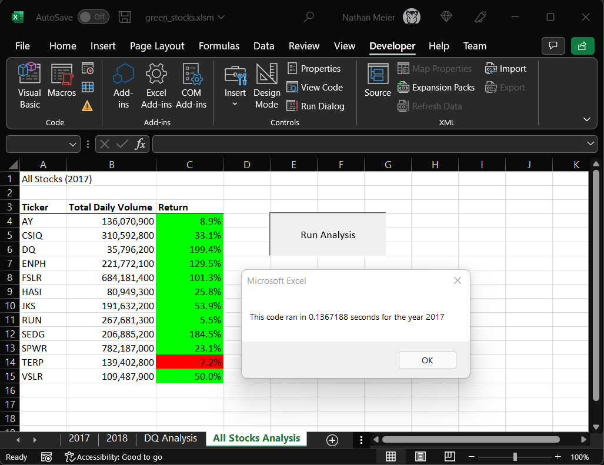
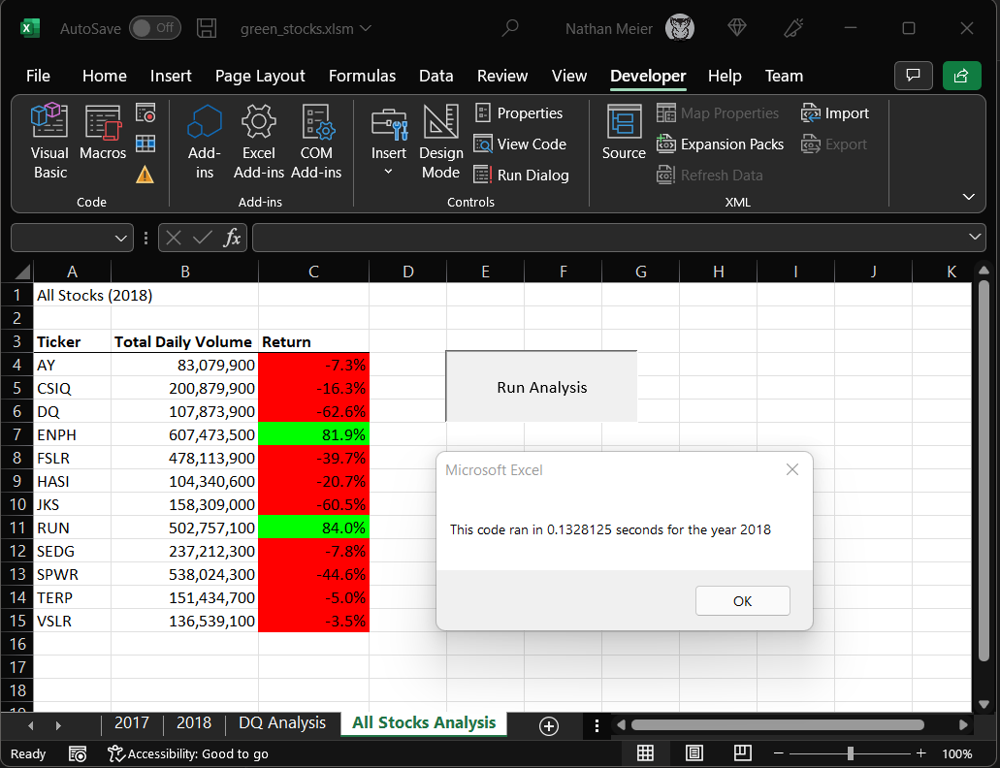

# stock-analysis

## Overview of Project

Provide an analysis of stock data to gain insights into potential green energy investments. The focus of the analysis is to identify potential stocks for a diverse portfolio. 

The excel sheet utilizes VBA Macros to allow the client to run analysis with a button. The client can add additional sheets with similar data and still be able to run the analysis.

## Results

Analysis Macro was run for 2017 and only took ~0.14 seconds. We can see most stocks had positive returns, but TERP was in the red.

Analysis Macro was run for 2018 and only took ~0.13 seconds. We can see most stocks had negative returns, with only two in the green this time.

## Summary

### What are the advantages or disadvantages of refactoring code?

The advantages depend on the objective. Refactoring can help improve performance, stability, security, and simplify usage.

There is always a risk to introduce bugs with any code change, but we can mitigate most of the risks with proper test cases.

### How do these pros and cons apply to refactoring the original VBA script?

We were able to simplify usage while improving performance. We combine analysis results and formatting, so the user only needs to push one button and choose the sheet to analysis.

By combining analysis results and formatting, we remove some ability to reuse code in the future. 
